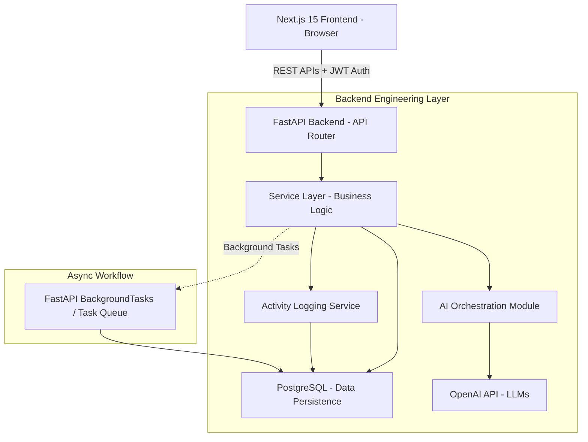

# SignalDesk AI - Architecture & System Design

## 1. System Architecture Diagram

## 2. Backend Architecture: The Layered Pattern

In startup engineering, a **monolithic but modular** approach is favored early on. We are utilizing a **Layered (N-Tier) Architecture** with Domain-Driven design influences.

- **API Layer (`/api`)**: Handles HTTP requests, authentication, and validation via Pydantic. It strictly *routes* data and knows nothing about business rules.
- **Service Layer (`/services`)**: The "Brain" of the application. It contains all business logic (e.g., how a ticket is assigned, how an AI response is processed). This separation means we can change our API framework or our database without changing the business logic.
- **Data Access Layer (`/models` & `/schemas`)**: Handles SQLAlchemy models and Pydantic schemas. Models represent DB tables; schemas represent API contracts.
- **AI Layer (`/ai`)**: A dedicated module specifically for wrapping LLM logic. It isolates prompt engineering, token limits, and AI API calls from standard business logic.

**Why this scales:** As the company grows, if the AI processing becomes too heavy, we can easily slice the `/ai` folder into its own microservice.

## 3. Database Schema

We are using PostgreSQL (via Supabase). The schema is fully relational, normalized (3NF), and built for auditability.

### Core Tables

1. **`users`**
   - `id` (UUID, Primary Key)
   - `email` (String, Unique, Indexed)
   - `hashed_password` (String)
   - `role` (Enum: ADMIN, AGENT, CUSTOMER)
   - `created_at`, `updated_at` (Timestamps)

2. **`tickets`**
   - `id` (UUID, Primary Key)
   - `customer_id` (UUID, Foreign Key -> users.id)
   - `agent_id` (UUID, Foreign Key -> users.id, Nullable)
   - `subject` (String)
   - `description` (Text)
   - `status` (Enum: OPEN, IN_PROGRESS, RESOLVED, CLOSED)
   - `urgency` (Enum: LOW, MEDIUM, HIGH, CRITICAL)
   - `created_at`, `updated_at` (Timestamps)

3. **`ai_responses`**
   - `id` (UUID, Primary Key)
   - `ticket_id` (UUID, Foreign Key -> tickets.id)
   - `summary` (Text, Nullable)
   - `suggested_reply` (Text, Nullable)
   - `tokens_used` (Integer)
   - `created_at` (Timestamp)

4. **`activity_logs`**
   - `id` (UUID, Primary Key)
   - `user_id` (UUID, Foreign Key -> users.id, Nullable for System/AI)
   - `action` (String - e.g., "TICKET_CREATED", "AI_URGENCY_CLASSIFIED")
   - `resource_id` (UUID - e.g., ticket_id)
   - `metadata` (JSONB - Flexible storage for changes)
   - `created_at` (Timestamp)

**Database Engineering Notes:**
- **JSONB for Logs:** `activity_logs.metadata` uses `JSONB` which is highly scalable for unstructured audit data while remaining queryable in PostgreSQL.
- **Foreign Key Indexes:** We will index foreign keys (`customer_id`, `agent_id`) because read queries for "get all tickets for this agent" will be extremely common.
- **UUIDs over Ints:** Using UUIDs prevents ID guessing attacks (Enumeration) and makes database merging/sharding easier in the future.
